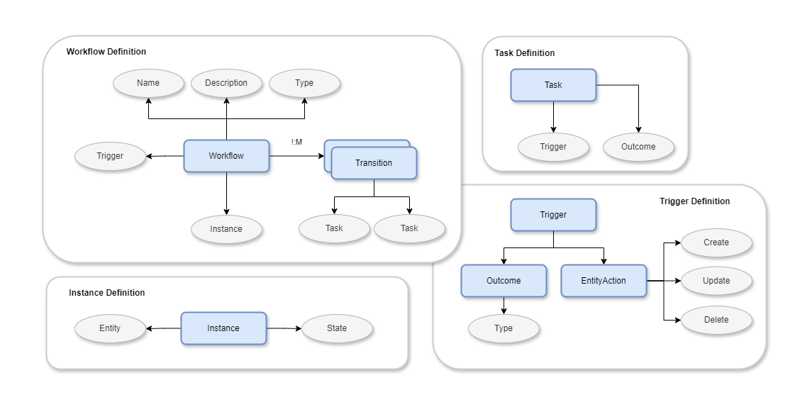

# abacus
## Simple Workflow framework in .Net
> Allows creating workflow templates with tasks transitions, triggered by outcomes of constituent tasks and entity actions linked to workflow (such as create, update or delete of linked entity).
### Design

### Concept
- `Workflow Template` defines a sequence of task and transtions linked to an entity of interest.
- `Task` is an unit of work that needs to be completed and can have an outcome associated upon completion.
- `Workflow Instance` is actual execution of workflow template triggered by an action on the instance of associated entity. Instance persists the current state of the workflow for the entity instance.
- Sequences of Tasks could be configured with multiple `transitions` with triggers driving different levels of branching.
- Tasks could be `triggered` by `outcomes` of previous task or an `action` on the workflow associated entity.
### Example Workflow
- Coming soon
